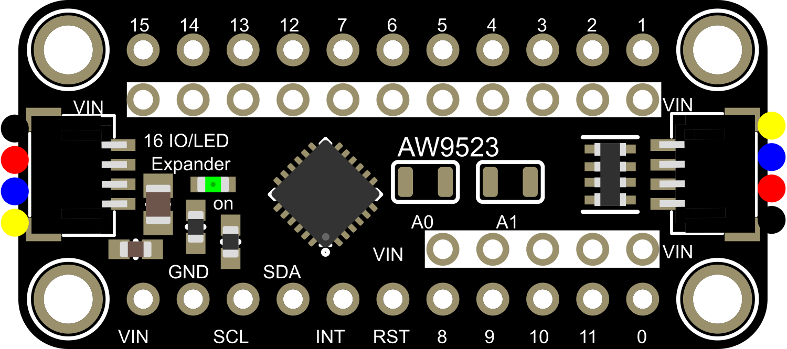

# Development Note: AW9523 Traffic Light on T-SIM7080G-S3

## Overview

This document describes the implementation of a **traffic light demo** using the
**AW9523 I²C LED expander** connected to a **LilyGO T-SIM7080G-S3 (ESP32-S3)** board.



The demo implements:

- A 3‑color traffic light (green, yellow, red) using LED outputs on the AW9523.
- Optional “relay outputs” reusing LED channels to drive relay‑module inputs
  (or additional LEDs) in sync with the green and yellow phases.
- Smooth **fade‑in / fade‑out** per light using the AW9523’s **DIM registers**.

This note focuses on the **software structure** and **pin mapping**, not on
precise electrical design of the relay drivers.

---

## Hardware context

### Base board

- **MCU:** ESP32‑S3 (LilyGO T‑SIM7080G‑S3)
- **PMU:** AXP2101 (manages power rails, modem power, etc.)
- **I²C for external devices (camera‑safe bus):**
  - `I2C_NUM_1`
  - `SDA = GPIO3`
  - `SCL = GPIO43`
  - Typically 100 kHz

This bus is also used in `post_diagnostics.cpp` for I²C scanning, and we reuse
the same configuration for the AW9523.

### AW9523 LED expander

- Connected to the **I²C external bus**:
  - SDA → GPIO3
  - SCL → GPIO43
- Supply voltage:
  - 3.3 V or 5 V, depending on breakout and load
  - For direct connection to ESP32‑S3 I²C, the AW9523’s I/O must be
    3.3 V‑tolerant or level‑shifted.

### Traffic light pin mapping on the AW9523

We use these pins on the AW9523:

- **Green LED:** `P0_1` → AW9523 pin **1**
- **Green relay LED/output:** `P0_2` → AW9523 pin **2**
- **Yellow LED:** `P0_6` → AW9523 pin **6**
- **Yellow relay LED/output:** `P0_7` → AW9523 pin **7**
- **Red LED:** `P1_7` → AW9523 pin **15**

All these pins are configured in **LED mode** using the AW9523’s LED‑mode registers.

The “relay” pins (2 and 7) are treated as extra LED outputs that go to **full
brightness (0xFF)** during their corresponding traffic light phase. They can
either drive LEDs directly, or feed optocoupler inputs on a relay module.

---

## AW9523 register usage

### LED mode configuration

The AW9523 uses two LED‑mode registers:

- `LED_MODE_P0` at `0x12` (for P0_0..P0_7)
- `LED_MODE_P1` at `0x13` (for P1_0..P1_7)

Per bit:

- `0` = LED mode (using DIM register)
- `1` = GPIO mode

The function:

```cpp
static esp_err_t aw9523_set_led_mode_for_pin(uint8_t pin);
```

does the following:

1. Selects the proper LED mode register (`0x12` or `0x13`).
2. Clears the bit for the specified pin to **0**, activating LED mode.

We call this for pins 1, 2, 6, 7, and 15 during `aw9523_traffic_light_init()`.

### Brightness / DIM registers

Brightness is set via the DIM registers. The mapping is:

- DIM0..DIM15: `0x20..0x2F`
- For pins 0..7 (P0_0..P0_7), we use `DIM4..DIM11`:
  - `DIM4` (0x24) = P0_0
  - `DIM5` (0x25) = P0_1
  - ...
  - `DIM11` (0x2B) = P0_7
- For pins 8..11 (P1_0..P1_3), we use `DIM0..DIM3` (0x20..0x23).
- For pins 12..15 (P1_4..P1_7), we use `DIM12..DIM15` (0x2C..0x2F).

The helper:

```cpp
static uint8_t aw9523_dim_reg_for_pin(uint8_t pin);
static esp_err_t aw9523_set_led_level(uint8_t pin, uint8_t level);
```

translates a logical pin (0..15) to the correct DIM register and writes the
desired brightness (0..255).

---

## I²C driver usage (ESP‑IDF new driver)

We use the **new I²C master driver** introduced in recent ESP‑IDF versions:

- `i2c_master_bus_config_t` + `i2c_new_master_bus()`
- `i2c_device_config_t` + `i2c_master_bus_add_device()`
- `i2c_master_transmit()` and `i2c_master_transmit_receive()`

The AW9523 device is configured with:

```cpp
dev_cfg.dev_addr_length = I2C_ADDR_BIT_LEN_7;
dev_cfg.device_address  = 0x58;
dev_cfg.scl_speed_hz    = 100000;
```

A `s_i2c_bus` (bus handle) and `s_aw_dev` (device handle) are stored in static
variables and reused during lifetime.

Low‑level register access is wrapped in:

```cpp
static esp_err_t aw9523_write_reg(uint8_t reg, uint8_t value);
static esp_err_t aw9523_read_reg(uint8_t reg, uint8_t* value);
```

These simply send `reg` and/or receive one byte using
`i2c_master_transmit(_receive)` with a short timeout.

---

## Traffic light logic

### Initialization (`aw9523_traffic_light_init`)

The init function performs:

1. Create I²C master bus on `I2C_NUM_1` (SDA=3, SCL=43) if not yet created.
2. Add AW9523 device at address `0x58` (7‑bit).
3. Optionally read and log `GCR` (0x11) for diagnostics.
4. Configure the five used pins (1, 2, 6, 7, 15) to **LED mode**.
5. Set all their DIM values to `0x00` (off).

This ensures a known start state: all LEDs and “relay” outputs are off.

### Fade helper (`aw9523_fade_single`)

The heart of the visual behavior is:

```cpp
static void aw9523_fade_single(uint8_t active_pin, TickType_t step_delay);
```

For each color phase:

1. Determine whether this is the **green phase** or **yellow phase**:
   - If active pin = `PIN_GREEN_LED` → enable `PIN_GREEN_REL` (0xFF), disable `PIN_YELLOW_REL`.
   - If active pin = `PIN_YELLOW_LED` → enable `PIN_YELLOW_REL` (0xFF), disable `PIN_GREEN_REL`.
   - Otherwise (red phase) → both “relay” DIMs are set to 0x00.
2. **Fade in** the active LED:
   - Loop `level` from 0 to 255 in small steps (e.g. +4).
   - For each step, write `level` to the active LED’s DIM register.
   - Ensure the other traffic light LEDs are set to 0.
   - Wait `step_delay` each iteration.
3. **Fade out** the active LED:
   - Loop `level` from 255 down to 0 in the same step size.
   - Update the active LED’s DIM value likewise.
4. At the end of the phase:
   - All three traffic light LEDs (green, yellow, red) are set to 0.
   - Both “relay” LEDs are set to 0.

This yields a smooth fade‑in and fade‑out sequence per color, while the
corresponding relay LED stays at full brightness during the phase.

### Main loop (`aw9523_traffic_light_run`)

The main loop:

```cpp
void aw9523_traffic_light_run(void)
{
    if (aw9523_traffic_light_init() != ESP_OK) {
        ESP_LOGE(TAG, "Init failed, aborting traffic light demo");
        return;
    }

    const TickType_t step_delay = pdMS_TO_TICKS(20);

    while (true) {
        ESP_LOGI(TAG, "Traffic light: fade GREEN");
        aw9523_fade_single(PIN_GREEN_LED, step_delay);
        pmu_log_battery_metrics();

        ESP_LOGI(TAG, "Traffic light: fade YELLOW");
        aw9523_fade_single(PIN_YELLOW_LED, step_delay);
        pmu_log_battery_metrics();

        ESP_LOGI(TAG, "Traffic light: fade RED");
        aw9523_fade_single(PIN_RED_LED, step_delay);
        pmu_log_battery_metrics();
    }
}
```

Notes:

- `step_delay = 20 ms` and step size 4 for DIM values give roughly
  ~1.28 s for fade‑in + ~1.28 s for fade‑out per color.

---

## Electrical notes (relays)

The “relay” pins (2 and 7) are currently treated as LED channels:

- They output a **current‑controlled LED signal**, not a high‑current
  GPIO drive.
- In practice, this is ideal for:
  - Driving **LED indicators**, or
  - Driving the **input of an optocoupler** on a relay board.

We are using 2 Relay Module with Hig/Low Trigger, well protection the output pins of the expander

If you want to drive **bare relay coils** directly, you must:

1. Use a **transistor or MOSFET** per relay (with base/gate driven by
   the AW9523 LED output).
2. Add a **flyback diode** across each relay coil.
3. Ensure the relay’s supply voltage (e.g. 5 V) shares GND with the AW9523
   and the ESP32‑S3.

This is deliberately not implemented in the code; it belongs to the
hardware design stage.

---

## Summary

This traffic light demo shows how to:

- Use the AW9523 as a flexible LED driver via the new ESP‑IDF I²C master API.
- Implement smooth fades using DIM registers.
- Synchronously drive additional LED channels (or relay inputs) for green
  and yellow phases.
